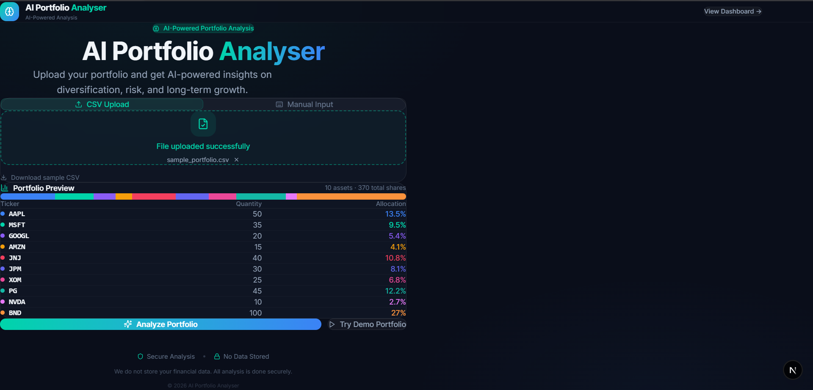
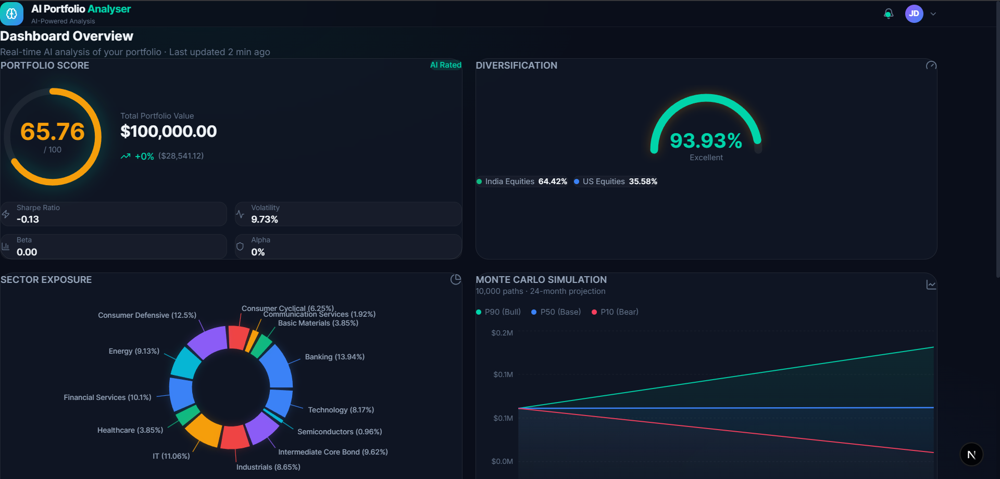
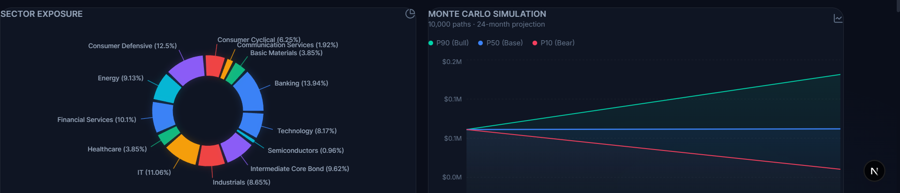
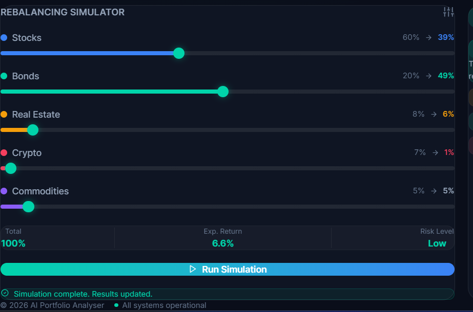

# AI Portfolio Analyser 📊

> An AI-powered portfolio analytics platform that analyses your stock and ETF holdings in real time — scoring diversification, projecting future value, and generating intelligent investment insights.

**Built by [Akash](https://github.com/akash7-8)**

---

## 🚀 Live Demo

> Coming soon — deploying on Vercel + Render

---

## 📸 Screenshots

| Landing Page | Dashboard Overview |
|---|---|
|  |  |

| Sector Exposure | Monte Carlo Simulation |
|---|---|
|  |  |

---

## 🧠 What It Does

Upload your portfolio (CSV or manual input) and get:

- **Portfolio Score** — composite score out of 100 combining diversification, return, risk, and stability
- **Diversification Analysis** — HHI-based gauge with asset class breakdown (India Equities, US Equities, Bonds, ETFs)
- **Sector Exposure** — donut chart showing concentration across Banking, IT, Healthcare, Energy etc.
- **Monte Carlo Simulation** — 10,000-path projection over 24 months showing Bull (P90), Base (P50), and Bear (P10) scenarios
- **Risk Metrics** — Sharpe Ratio, Volatility, Beta (vs Nifty50/S&P500), Alpha (Jensen's), Annual Return
- **Rebalancing Simulator** — adjust asset class sliders and simulate the impact on your portfolio
- **AI Insights** — SWOT-style analysis engine generating Strength, Weakness, Opportunity, and Threat findings

---

## 🏗️ Architecture

```
ai-portfolio-analyser/
├── frontend-ui/                  # Next.js 15 frontend
│   ├── src/app/                  # App Router pages
│   │   ├── page.tsx              # Landing page (CSV + manual input)
│   │   └── dashboard/page.tsx    # Analytics dashboard
│   ├── src/components/           # UI components
│   │   ├── PortfolioScoreCard.tsx
│   │   ├── DiversificationGauge.tsx
│   │   ├── SectorExposure.tsx
│   │   ├── MonteCarloChart.tsx
│   │   ├── RebalanceSimulator.tsx
│   │   ├── AIExplanationPanel.tsx
│   │   ├── CSVUploader.tsx
│   │   ├── ManualInput.tsx
│   │   └── PortfolioPreview.tsx
│   └── src/lib/api.ts            # API layer
│
└── backend/                      # FastAPI backend
    ├── main.py                   # API endpoints + orchestration
    ├── data_fetcher.py           # yfinance live price fetching
    ├── diversification.py        # HHI diversification engine
    ├── portfolio_engine.py       # Portfolio scoring model
    ├── risk_metrics.py           # Beta, Alpha, Sharpe, daily change
    ├── sector_analysis.py        # Sector classification
    ├── simulation.py             # Monte Carlo simulation
    ├── rebalance.py              # Rebalancing engine
    ├── recommendation_engine.py  # Rule-based SWOT insights
    └── data/sector_map.json      # Sector metadata
```

---

## 🔧 Tech Stack

| Layer | Technology |
|---|---|
| Frontend | Next.js 15, TypeScript, Tailwind CSS |
| Backend | FastAPI, Python |
| Data | yfinance (live prices + historical returns) |
| Simulation | NumPy (Monte Carlo — 10,000 paths) |
| Diversification | Herfindahl-Hirschman Index (HHI) |
| Risk Metrics | Jensen's Alpha, Covariance-based Beta |
| Communication | REST API, CORS |

---

## 📡 API Endpoints

### `POST /analyze_portfolio`

Accepts a list of stock/ETF holdings with quantities. Returns full portfolio analysis.

**Request:**
```json
{
  "assets": [
    { "ticker": "AAPL", "quantity": 50 },
    { "ticker": "TCS.NS", "quantity": 20 },
    { "ticker": "GOLDBEES.NS", "quantity": 100 }
  ]
}
```

**Response includes:**
```json
{
  "portfolio_score": {
    "score": 72.4,
    "totalValue": 284532.10,
    "annualReturn": 0.142,
    "dailyChangePct": 0.34,
    "dailyChangeDollar": 968.21,
    "sharpeRatio": 1.12,
    "volatility": 13.28,
    "beta": 0.87,
    "alpha": 4.32,
    "benchmark": "^GSPC",
    "riskFreeRate": 0.05
  },
  "diversification_score": { "score": 81.2, "assetClasses": [...] },
  "sector_exposure": [...],
  "simulation": [
    { "label": "M0", "p10": 284532, "p50": 284532, "p90": 284532 },
    { "label": "M24", "p10": 198432, "p50": 312847, "p90": 445231 }
  ],
  "explanation": [
    { "type": "positive", "title": "Strength", "text": "..." },
    { "type": "warning", "title": "Weakness", "text": "..." },
    { "type": "positive", "title": "Opportunity", "text": "..." },
    { "type": "negative", "title": "Threat", "text": "..." }
  ]
}
```

### `POST /rebalance_simulation`

Simulates the effect of reallocating across asset classes.

**Request:**
```json
{
  "assets": [
    { "ticker": "Stocks", "weight": 0.55 },
    { "ticker": "Bonds", "weight": 0.25 },
    { "ticker": "Real Estate", "weight": 0.10 },
    { "ticker": "Crypto", "weight": 0.05 },
    { "ticker": "Commodities", "weight": 0.05 }
  ]
}
```

---

## ⚙️ Local Setup

### Prerequisites
- Node.js 18+
- Python 3.10+
- pip

### Backend

```bash
cd backend
python -m venv venv
venv\Scripts\activate        # Windows
# source venv/bin/activate   # Mac/Linux

pip install -r requirements.txt
uvicorn main:app --reload
```

Backend runs at `http://localhost:8000`
API docs available at `http://localhost:8000/docs`

### Frontend

```bash
cd frontend-ui
npm install
```

Create `.env.local`:
```
NEXT_PUBLIC_API_URL=http://localhost:8000
```

```bash
npm run dev
```

Frontend runs at `http://localhost:3000`

---

## 📂 CSV Format

Upload a CSV file with two columns:

```csv
ticker,quantity
AAPL,50
MSFT,35
TCS.NS,20
GOLDBEES.NS,100
BND,80
```

- Indian NSE stocks: append `.NS` (e.g. `RELIANCE.NS`)
- Common aliases supported: `HUL → HINDUNILVR`, `HDFC → HDFCBANK`, `HERO → HEROMOTOCO`
- ETFs supported: GOLDBEES, SILVERBEES, NIFTYBEES, LIQUIDBEES and more

---

## 🗺️ Roadmap

- [x] Portfolio scoring engine (diversification + return + risk + stability)
- [x] Sector exposure analysis with concentration warnings
- [x] Monte Carlo simulation (10,000 paths, 24-month projection)
- [x] Beta and Alpha computation vs Nifty50 / S&P500
- [x] Rebalancing simulator
- [x] Indian stock + ETF support with alias normalization
- [x] Rule-based SWOT insight engine
- [ ] LLM-based AI advisor (replacing rule-based engine)
- [ ] MCP integration — tool-calling AI agents over backend functions
- [ ] Chat-based AI advisor UI
- [ ] Deploy frontend on Vercel + backend on Render

---

## 📌 Notes on Data

- All data is fetched live from Yahoo Finance via `yfinance`
- No broker integration or CDSL access — portfolios are entered manually or via CSV for security and compliance
- No user data is stored — all analysis is stateless and session-based

---

## 👤 Author

**Akash** — [@akash7-8](https://github.com/akash7-8)

---

## 📄 License

MIT License — free to use, modify, and distribute.
